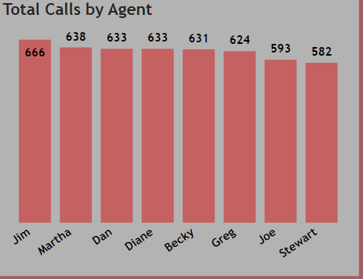
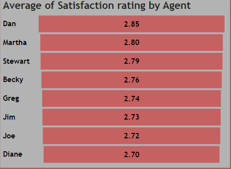
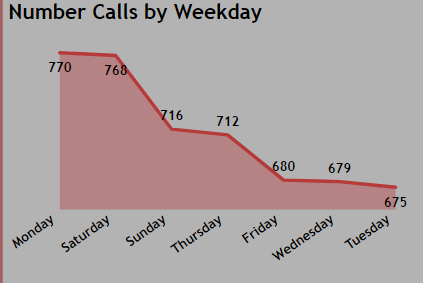

# CALL CENTER ANALYSIS

## Introduction
A call center analysis performed on Microsoft Power BI. This report includes visualizations to provide accurate insights to help make informed data driven decisions.
### Power BI features applied:
- DAX
- Filters
- Power query

## Problem Statement
1.	Which agent made the most number of calls?
2.	Which agent has the highest satisfaction rating?
3.	What month records the highest number of calls?
4.	What day records the most number of calls?
5.	What topic has the highest number of callers?

## Data Analysis and Visualizations

### Agent with the most number of calls?

- With reference to the visualization, Jim emerges the agent with the highest number of callers with the total of 666 calls.

### Agent with the highest satisfaction rating based on performance?

- It can be concluded that Dan performed his role as a call center agent best as he has the highest satisfaction rating of 2.85

### Days with the most number of calls recorded

- Monday and Saturday records the highest number of calls.

### Insights
- A total of 5,000 calls were recorded in 3 months.
- January emrges the month with the highest number of calls.
- Dan is the most satisfacory call agent.
- Customers called the most on Monday and Saturday.
- Streaming arises as the most frequent reason customers call.
